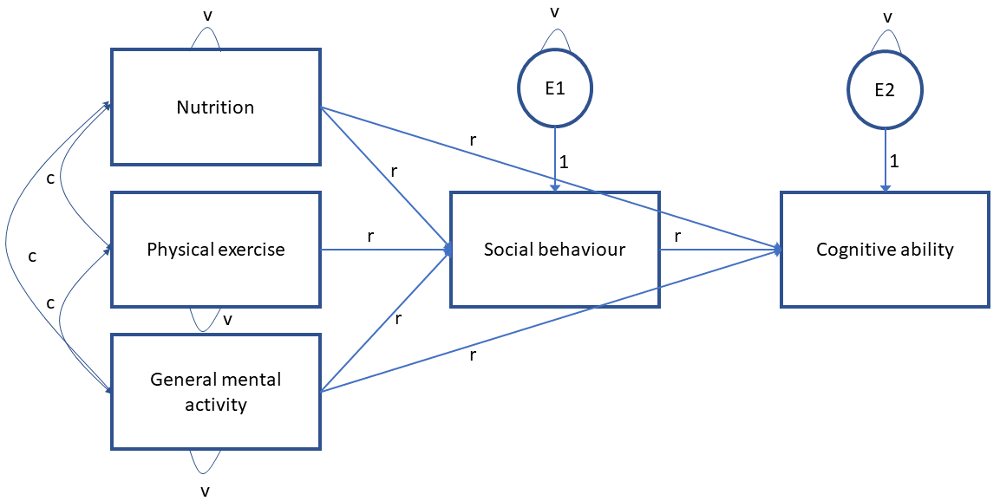

```{r setup, include=FALSE}
knitr::opts_chunk$set(echo = TRUE)
```

## Non-alphabetical glossary for Advanced Statistical Methods for Psychologists (PSY6210) at The Sheffield University

### Probability distribution

Mathematical functions that describe the probabilities of occurrence of different possible outcomes: [link](https://en.wikipedia.org/wiki/Probability_distribution). For example, __Binomial__ distribution is a discrete probability distribution (1 or 0), thus it has countable number of outcomes (contrary continuous probability distribution can take any value on a specific range of values - Gaussian). The binomial distribution has two parameters and we can write it as $X \sim B(n,p)$ - __n__ number of events and __p__ probability of a successful trial. The Gaussian distribution can also be described with two parameters $X \sim N(\mu, \sigma)$ - $\mu$ - arithmetic mean and $\sigma$ - dispersion around the mean or standard deviation.

### Statistical moments 
Relates to the concept of "moments" in physics (e.g. moment of inertia). Moments quantify distributional shapes, their location (mean), shape (overall geometry), and scale (spread). Check this great [blog](https://gregorygundersen.com/blog/2020/04/11/moments/) by Gregory Gundersen.

### Arithmetic mean, variance, standard deviation, co-variance
[Mean ($\mu$)](https://en.wikipedia.org/wiki/Arithmetic_mean) - measure of central tendency <br/>
[Variance ($\sigma^2$)](https://en.wikipedia.org/wiki/Variance) - measure of dispersion around the mean. [Expected value](https://en.wikipedia.org/wiki/Expected_value) of the squared deviation from the mean - $Var(X)=E[(X-\mu)^2]$. You can look at it as covariance of a variable with itself - $Cov(X,X)$ <br/>
[Standard deviation ($\sigma$)](https://en.wikipedia.org/wiki/Standard_deviation) - measure of dispersion around the mean. Square root of the variance <br/>
```{r, fig.align='center', echo=FALSE, out.width='60%'}
knitr::include_graphics('normalD.png')
```

[Covariance $cov(X,Y)$](https://en.wikipedia.org/wiki/Covariance) - measure of joint variability of two variables. 
```{r, fig.align='center', echo=FALSE, out.width='60%'}

```


### Linear regression
Equation that summarises how the average values of dependent variable vary over values defined by linear function of a predictor. 

### Partial correlation
Measure of the degree of association (correlation) between two variables, with the influence/effect of other variables (eg. X2) controlled for both variables (eg. Y and X1). 

For example, when want to control for the effect Weight when estimating correlation between Age and Height of Babies. 
```{r, echo=FALSE, warning=FALSE, message=FALSE}
set.seed(456)
Babies=data.frame(Age=round(runif(100,1,30)), Weight=rnorm(100,4000,500))
Babies$Height=rnorm(100,40+0.2*Babies$Age+0.004*Babies$Weight, 5)
Babies$Sex=factor(rbinom(100,1,0.5))
levels(Babies$Sex)=c('Girls','Boys')
```
Just a simple correlation would be: 
```{r , warning=FALSE, message=FALSE}
cor(Babies$Age, Babies$Height)
```
The partial correlation would be: 
```{r, warning=FALSE, message=FALSE}
require(ppcor)
pcor(Babies[,1:3])$estimate
```
We can calculate this in steps: 
```{r, warning=FALSE, message=FALSE}
AgeRes=residuals(lm(Age~Weight, data=Babies)) # we take residuals of Age when modeled by Weight (take out the part of variance in Age explained by Weight)
HeightRes=residuals(lm(Height~Weight, data=Babies)) # we take residuals of Height when predicted by Weight (take out the part of variance in Height explained by Weight)
cor(HeightRes, AgeRes) # We calculate correlation
```

### Dummy coding of the categorical variables
Different ways how we can transform labels (categorical values) in numbers (1s and 0s) with the goal to use them in statistical models. Check different ways of dummy coding in R: [link](https://stats.oarc.ucla.edu/r/modules/coding-for-categorical-variables-in-regression-models/)

### Errors and residuals
[Link](https://en.wikipedia.org/wiki/Errors_and_residuals): Errors of an observed values is the deviation of the values from the __true__ (unknown) quantity of interest (e.g. population mean). The residuals is the difference between the observed values and the estimated value of the quantity of interest (e.g. sample mean) 

### Residual standard error
Measure of the model fit, where we measure standard deviation of the residuals in a regression model: $\sqrt(\frac{SS_{residual}}{df})$

### Coefficient of determination ($R^2$)
Proportion of the variation in the dependent variable explained by the independent variable(s): [link](https://en.wikipedia.org/wiki/Coefficient_of_determination). $R^2 = 1 - \frac{SS_{residual}}{SS_{total}}$ <br/><br/>

$SS_{residual}$ - we need to calculate the distances between predicted and observed values (vertical lines), square and sum them up.  
```{r, echo=FALSE, warning=FALSE, message=FALSE}
require(ggplot2)
lm1<-lm(Height~Age, data=Babies)
summary(lm1)
Babies$lm1=predict(lm1, newdata = Babies)
Babies$SSresid=Babies$lm1-Babies$Height
ggplot()+geom_linerange(data=Babies,aes(x=Age, ymin=Height,ymax=lm1,colour=SSresid), size=1.2)+geom_line(data=Babies,aes(x=Age, y=lm1), size=1.2)+geom_point(data=Babies, aes(Age, y=Height), size=2)+ylab('Height')+xlab('Age')+ggtitle('SS_residual')+theme(axis.title=element_text(size=14), axis.text =element_text(size=12))
```
<br/>
$SS_{total}$: To get total amount of variance, we can just calculate distances from the mean of the dependent variable, square and sum the up 
```{r, echo=FALSE}
lm0<-lm(Height~1, data=Babies)
summary(lm0)
Babies$lm0=predict(lm0, newdata = Babies)
Babies$SStotal=Babies$lm0-Babies$Height

ggplot()+geom_linerange(data=Babies,aes(x=Age, ymin=Height,ymax=lm0,colour=SStotal), size=1.2)+geom_line(data=Babies,aes(x=Age, y=lm0), size=1.2)+geom_point(data=Babies, aes(Age, y=Height), size=2)+ylab('Height')+xlab('Age')+ggtitle('SS_total')+theme(axis.title=element_text(size=14), axis.text =element_text(size=12))
```

```{r}
1-(sum(Babies$SSresid^2)/sum(Babies$SStotal^2))
```

### Semi-partial correlation
Similar to the partial correlation, but compares relation of two variables where influence of controls (third variable: X2) is held constant only for one variable and not both (only for X1 and not for Y). This way we get how much unique variation was explained by X1 in Y when accounting for the variance already explained by the X2. In other words, we get a unique contribution of predictors to the explained variance - can be used to compare importance/contribution of predictors. [Link](https://en.wikipedia.org/wiki/Partial_correlation#Semipartial_correlation_(part_correlation))

### F-statistic
Test that calculates whether our model is significant. In particular, does it explain/predict dependent variable better than null model, which in this case is only intercept model (just knowing the mean of the dependent variable). 

$F = \frac{SS_m/df_m}{SS_r/df_r}$

We need to calculate Sum of squares for our model ($SS_{model}$) - distances between the regression line proposed by our model and the null model (only intercept model).

```{r, echo=FALSE, fig.width=12, fig.height=5, fig.align='center', warning=FALSE}
Babies$SSmodel=Babies$lm1-Babies$lm0
ggplot()+geom_linerange(data=Babies,aes(x=Age, ymin=lm1,ymax=lm0,colour=SSmodel), size=1.2)+geom_line(data=Babies,aes(x=Age, y=lm0), size=1.2)+geom_line(data=Babies, aes(Age, y=lm1), size=1.3, linetype='dotdash')+geom_point(data=Babies, aes(x=Age, y=Height), size=0.9)+ylab('Height')+xlab('Age')+ggtitle('Improvement')+theme(axis.title=element_text(size=14), axis.text =element_text(size=12))
```

```{r}
(sum(Babies$SSmodel^2)/1)/(sum(Babies$SSresid^2)/98)
```

### Structural equation modelling 

Modelling framework used to test relationship between variables. The SEM model is composed of two parts: measurement model and structural model. It is often used (should be used) to test and evaluate multivariate causal relationships. Check more here: [link](https://ecologicalprocesses.springeropen.com/articles/10.1186/s13717-016-0063-3#:~:text=Structural%20equation%20modeling%20(SEM)%20is,on%20pre%2Dassumed%20causal%20relationships.)

### Total number of parameters
Number of free parameters that we can estimate using specific number of elements (variables):<br/>
$\frac{variables*(variables+1)}{2}$

### Number of parameters estimated in the proposed model:
It depends on the underlying model - always check the degrees of freedom and compare them with the drawing of the model. For example:<br/>


### Model identification
Model coefficients can only be estimated if the model has: <br/>
1. The same number of total and estimated parameters (just-identified) <br/>
2. More total than estimated parameters (over-identified model) <br/>
Alternatively, it will under-identified. 

### Fit Indices of SEM model


### Confirmatory Factor Analysis (CFA)

Model that investigates latent space of measures (measurement model). In comparison to the exploratory factor analysis, CFA is theory driven approach. We have strong assumptions and expectations how many factors are there and how are individual measures loading onto these latent factors. <br/>
$y_1=\tau_1+\lambda_1*\eta+\epsilon_1$<br/><br/>

$\tau$ - the item intercepts or means<br/>
$\lambda$ - factor loadings - regression coefficients  <br/>
$\epsilon$ - error variances and covariances  <br/>
$\eta$ - the latent predictor of the items<br/>
$\psi$ - factor variances and covariances  <br/>

### Type of factors: reflective and formative

A reflective measurement model happens when the indicators of a construct are considered to be caused by that construct. A formative measurement model happens when the measured variables are considered to be the cause of the latent variable.


### Defining the scale of latent variables
We have different options, most common ones are:<br/><br/> 
1. Marker variable: single factor loading constraint to 1 <br/><br/>
2. Standardized latent variables: setting variance of variable to 1  (Z-score) <br/><br/> 
3. Effects-coding: constraints that all of the loadings to one LV average 1.0 or that their sum is equal to number of indicators

### Full SEM model
Combination between measurement and structural model: 


### Measurement invariance

Measurement invariance or measurement equivalence is a statistical property of measurement that indicates that the same construct is being measured across some specified groups: <br/><br/> 
1. Configural invarience: Model fitted for each group separately <br/><br/> 
2. Metric invariance: restriction of the factor loadings, but intercepts are allowed to vary <br/><br/> 
3. Scalar invariance: restriction of the both, factor loadings and intercepts <br/><br/> 
4. Strict invariance: restriction on factor loadings, intercepts and residual variances